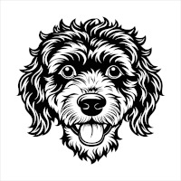

# Truffle

A Slack bot that helps you find the experts in your organization.

Truffle indexes your public Slack channels and assigns domains of expertise to Slack users.
You can ask Truffle to find persons of a certain skill and it will reply to with the persons in your organization that demonstrated that skill in the past.

No private channels or direct messages are read. No user messages are stored.

---
Built by [Anton Pirker](https://github.com/antonpirker) during Sentry Hackweek 2025.

The truffle dog image is from [Vecteezy](https://www.vecteezy.com).
